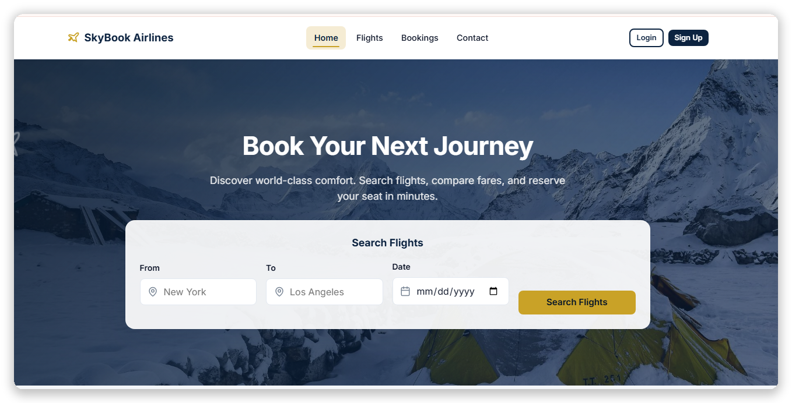
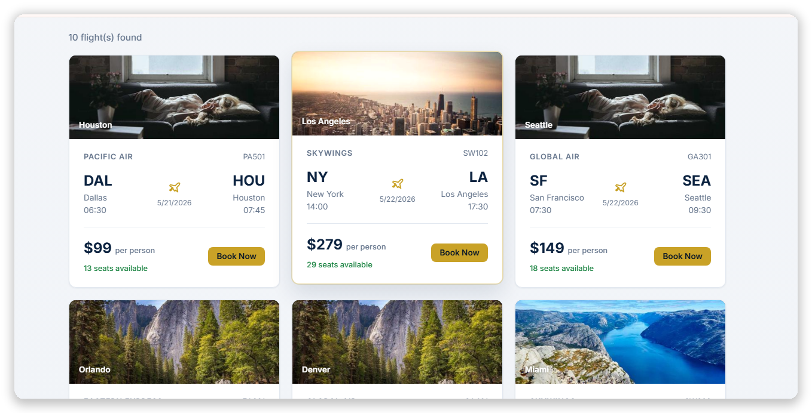
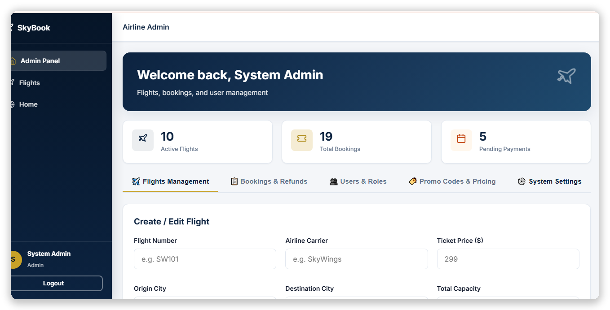
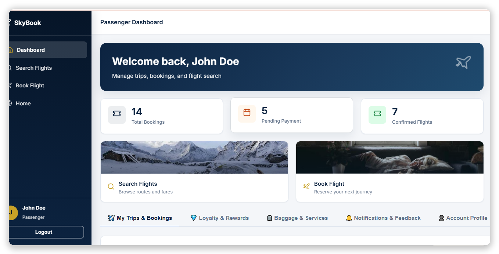
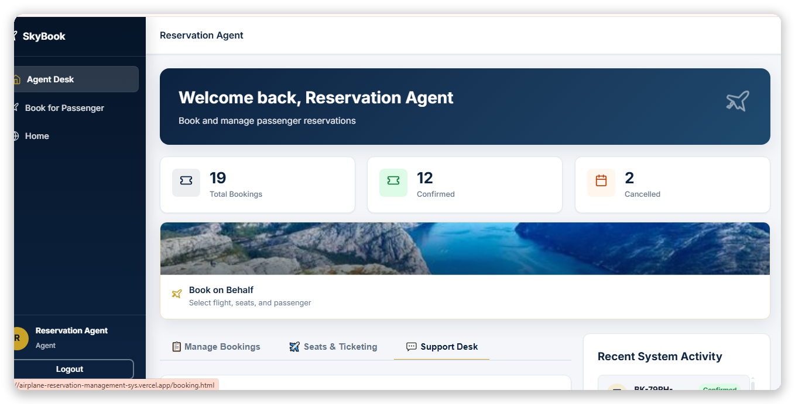
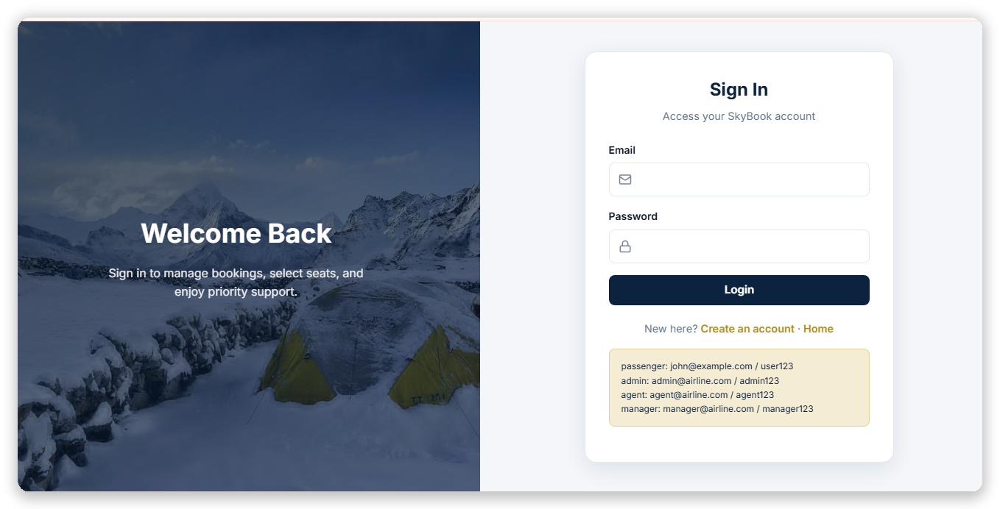
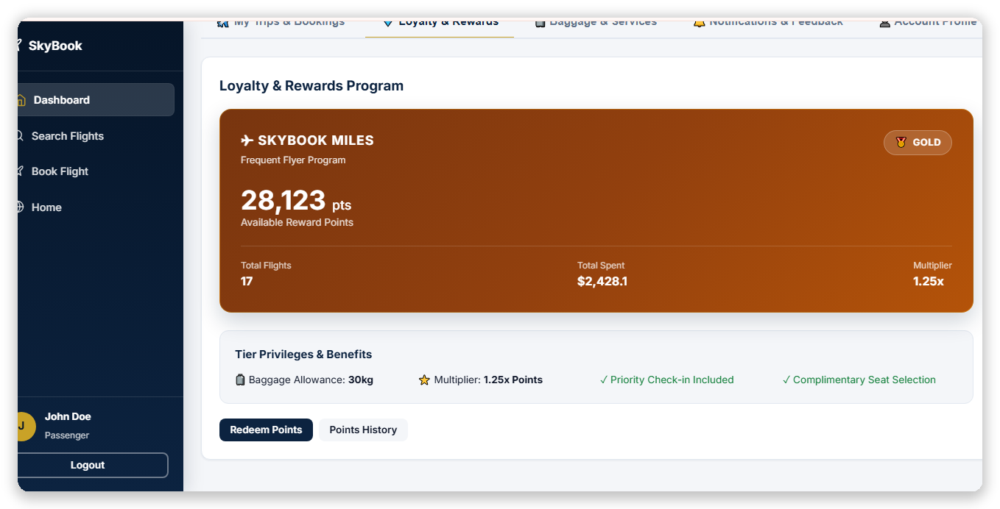
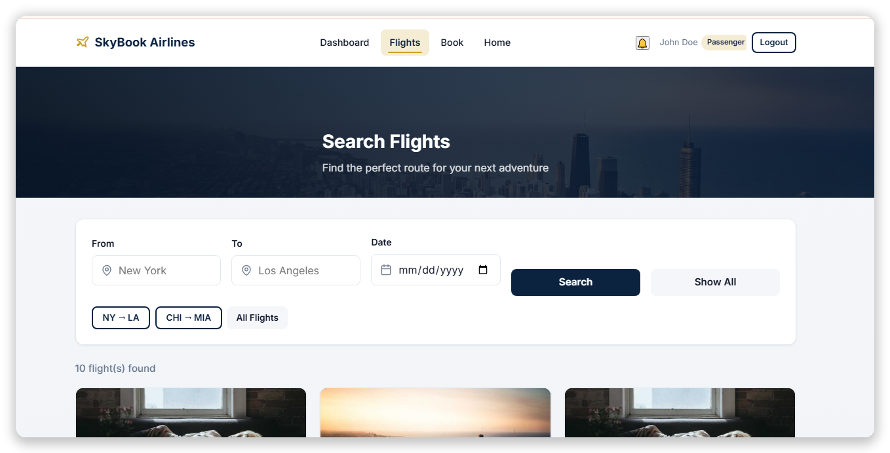
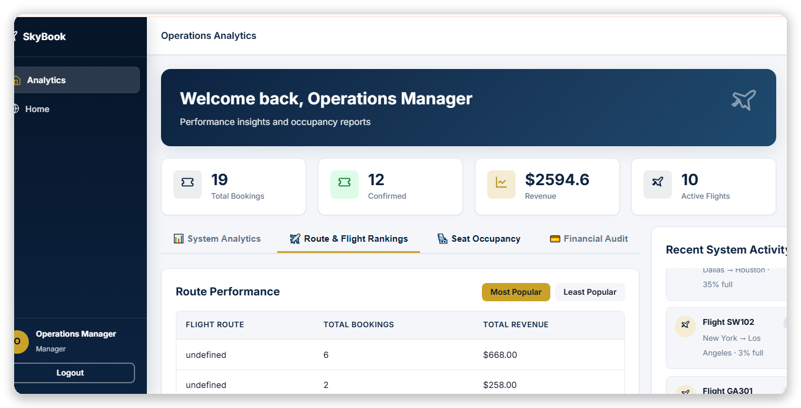
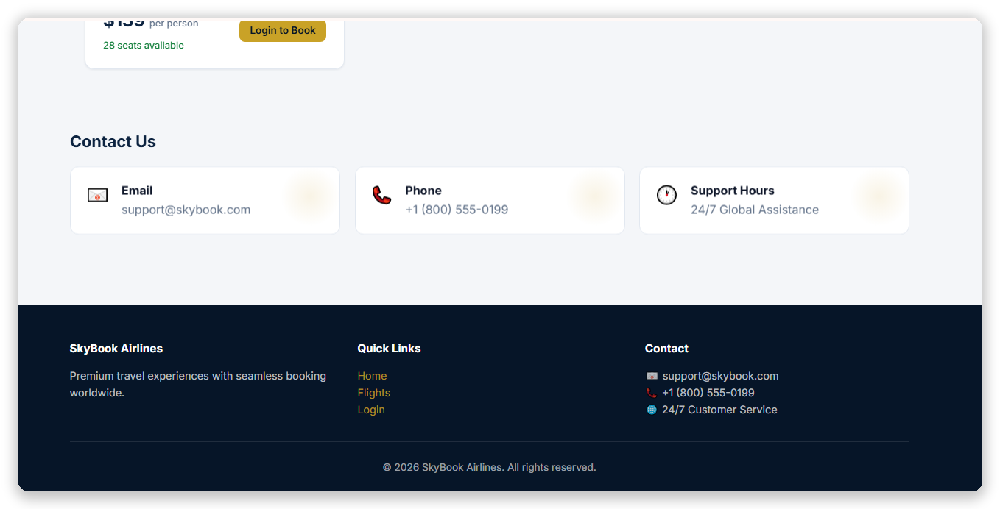

# ✈️ Airline Reservation Management System

A full-stack web application for managing airline reservations, flights, passengers, agents, managers, and administrative operations.

🌐 **Live Demo:** https://airplane-reservation-management-sys.vercel.app/

---

## 📸 Screenshots

### 🏠 Home & Login





### 👤 Passenger Dashboard



### 🔎 Flight Search



### ✈️ Flight Results



### ⭐ Passenger Loyalty



### 👨‍💼 Agent Dashboard



### 📊 Manager Analytics



### 🛡️ Admin Dashboard



### 📞 Contact & Footer



---

## 🚀 Features

* ✈️ Flight search and reservation
* 👤 Passenger management
* 👨‍💼 Agent dashboard
* 📊 Manager analytics
* 🛡️ Admin dashboard
* ⭐ Passenger loyalty management
* 🔐 Role-based access
* 📱 Responsive UI
* 📈 Dashboard-based operations

---

## 🛠️ Tech Stack

* **Frontend:** HTML, CSS, JavaScript
* **Backend:** Node.js, Express.js
* **Database:** MongoDB
* **Deployment:** Vercel
* **Tools:** Git & GitHub

---

## 📂 Project Structure

```text
Airline-Reservation-Management-System/
│
├── backend/
├── frontend/
├── images/
│   ├── home-page.png
│   ├── login-page.png
│   ├── passenger-dashboard.png
│   ├── flights-search.png
│   ├── flights-results.png
│   ├── passenger-loyalty.png
│   ├── agent-dashboard.png
│   ├── manager-analytics.png
│   ├── admin-dashboard.png
│   └── contact-footer.png
│
├── package.json
└── README.md
```

---

## ⚙️ Run Locally

```bash
git clone YOUR_REPOSITORY_URL
cd Airline-Reservation-Management-System
npm install
npm start
```

For development:

```bash
npm run dev
```

---

## 🎯 User Roles

| Role         | Function                                |
| ------------ | --------------------------------------- |
| 👤 Passenger | Search flights & manage reservations    |
| 👨‍💼 Agent  | Manage passenger/reservation operations |
| 📊 Manager   | Monitor analytics & operations          |
| 🛡️ Admin    | Manage the complete system              |

---

## 🌐 Live Demo

👉 **https://airplane-reservation-management-sys.vercel.app/**

---

## 👨‍💻 Developer

**Software Engineering Project**
Built with modern full-stack web technologies.

⭐ If you like this project, consider giving it a star!
